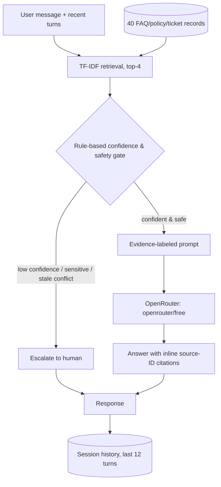

# LearnForge Support Assistant

A small, auditable RAG prototype for the supplied 40-entry LearnForge corpus
(15 FAQs, 10 policies, 15 historical support tickets). It answers support
questions grounded in that corpus, handles multi-turn conversation, and
escalates to a human whenever it isn't confident — rather than guessing.

- **Retrieval:** dependency-light TF-IDF (`scikit-learn`) with an authority
  tie-break (policy > FAQ > ticket) so retrieval and the escalation decision
  stay inspectable and testable without an API key.
- **Generation:** any free model on [OpenRouter](https://openrouter.ai) via its
  OpenAI-compatible REST API — defaults to `openrouter/free` (OpenRouter's
  auto-routed Free Models Router).
- **Interfaces:** a CLI (`app.py`) and a Streamlit web UI (`streamlit_app.py`),
  both built on the same orchestration core in `src/`.

The design is optimized for a ~4-6 hour take-home: a focused knowledge-base
entry is one chunk, every response carries labeled evidence, historical
tickets are precedent (never policy), and unsafe/uncertain cases are
escalated **before** the model is ever called.

## Quickstart

Requires Python 3.10+ and a free [OpenRouter API key](https://openrouter.ai/settings/keys).

```bash
pip install -r requirements.txt
cp .env.example .env        
python3 src/corpus.py       

# CLI
python3 app.py --session alice "I bought a course yesterday; can I get a refund?"
python3 app.py --session alice "What if I've already watched most of it?"

# Web UI
streamlit run streamlit_app.py
```

`--session <id>` persists the last 12 local turns under `.state/<id>.json`
(gitignored). The model itself only sees the last 6 turn-pairs per call. The
Streamlit UI keeps one session per browser session and has a "New session"
button plus example prompts in the sidebar.

Run the deterministic offline regression eval (no API key needed):

```bash
python evals/run_eval.py
```

> **Security note:** `.env` is gitignored — never commit your real key. If a
> key has ever been pasted anywhere outside your own `.env` (a chat, a ticket,
> a shared doc), treat it as compromised and rotate it at
> [openrouter.ai/settings/keys](https://openrouter.ai/settings/keys); OpenRouter
> keys are billing-linked even on the free tier.

## Architecture

See **[`docs/ARCHITECTURE.md`](docs/ARCHITECTURE.md)** for the full system
design diagram and a step-by-step trace of how a query flows end-to-end
through retrieval → gate → prompt → generation → session update → UI.



## Data schema

See **[`docs/DATA_SCHEMA.md`](docs/DATA_SCHEMA.md)** for the full field-by-field
breakdown, real examples, and the note on what changes (and what doesn't) if
this moves to a vector DB. Summary:

| Field | Example | Purpose |
|---|---|---|
| `id` | `POLICY-02` | Stable citation / eval target |
| `title` | `Cancellation and Refund Policy` | Retrieval signal, UI label |
| `source_type` | `policy` \| `faq` \| `ticket` | Drives authority ranking + prompt rules |
| `text` | full entry body | Evidence sent to the LLM |
| `reviewed` | `January 2026` (policy only) | Freshness visibility |
| `status` | `Resolved` (ticket only) | Prevents implying an open case is settled |
| `has_deprecated_note` | `true`/`false` | Flags entries containing superseded wording |
| `tags` | `["billing", "refund"]` | Human browsing / future filtered retrieval |

One supplied entry = one chunk/record (`data/corpus.json`, 40 rows); see the
Trade-offs section below for why, and what changes at larger/messier scale.

## Failure handling / safety

- **Low confidence:** top retrieval score below `0.12` → deterministic
  escalation, never an LLM guess.
- **Sensitive cases:** chargebacks, fraud claims, unrecognized/unauthorized
  charges, legal language, account deletion, and credential/payment-sensitive
  questions route to a human before the model is called. The assistant only
  ever asks for a support-safe account email and an order/transaction
  reference — never a password, full card number, or CVV.
- **Stale or conflicting knowledge:** entries are scanned at ingestion for
  phrases marking superseded content (e.g. `POLICY-02`'s note that an older
  7-day-refund article is not the current policy). If a user's own wording
  suggests they've spotted a conflict against a flagged entry, that routes to
  a human rather than letting the model pick a side.
- **Bad retrieval / API failure:** the gate keeps clearly unrelated questions
  from reaching the model at all. If OpenRouter returns an HTTP error, times
  out, or replies in an unexpected shape, `LLMError` is raised and the
  assistant returns a visible escalation — it never fabricates an answer. A
  production service would convert that into a retryable human-support
  handoff with a request ID and telemetry instead of a synchronous failure.
- **Prompt injection in sources or user input:** the system prompt explicitly
  instructs the model to treat everything inside `<context>` blocks and the
  user's message as data to reason about, never as instructions. Production
  should additionally scan sources at ingestion time and enforce
  structured, server-side citation checking rather than trusting the model's
  self-reported `[ID]` tags.

## Evaluation plan

`evals/cases.json` is a 10-case regression set spanning normal support
intents, a policy-should-outrank-a-similar-ticket case, two sensitive-case
triggers, a stale-policy-conflict case, and an out-of-domain question.
`evals/run_eval.py` is a real, executable, offline eval that checks two gates
that don't require calling the LLM:

1. **Retrieval recall@4** — at least one expected authoritative/relevant
   record ID is returned.
2. **Escalation routing accuracy** — the deterministic gate's route matches
   the expected safe outcome.

Both currently score 100% on this corpus (`python3 evals/run_eval.py`).

This deliberately does **not** claim to measure generated-answer quality
without a recorded model run — that needs the LLM in the loop. For a
production-quality answer eval I would:

- Maintain a versioned, reviewer-written eval set with **expected claims and
  citations** per question (not just expected source IDs), sampled from real
  or synthetic traffic and refreshed as the knowledge base changes.
- Run live generations against it and score with an **LLM-judge + human
  audit** on: claim support (is every sentence backed by a cited source?),
  citation precision (do the cited IDs actually contain the claim?),
  completeness, actionability, tone, and an explicit **unsafe/hallucinated
  claim rate** — the single number I'd block a release on.
- Report results **sliced** by normal / ambiguous / adversarial /
  stale-policy-conflict cases rather than one blended score, since a
  regression hidden inside the small adversarial slice is exactly the kind of
  thing an aggregate metric hides.
- Track escalation **precision and recall separately** — false escalations
  hurt user experience and cost; false non-escalations (confidently wrong
  answers) are the actual harm this whole design exists to prevent, so they
  should be weighted more heavily in any go/no-go decision.

## Trade-offs and what I'd change with more time/budget

**Lexical (TF-IDF) retrieval over a vector database.** The corpus is only 40
short, well-formed entries, so a transparent, offline, zero-network-per-query
retriever keeps the repo fast, debuggable, and evaluable without an API key —
`evals/run_eval.py` runs in under a second. It will miss paraphrases,
synonyms, and cross-lingual queries that don't share vocabulary with the
source text. With more budget I'd move to OpenRouter/provider embeddings +
hybrid BM25/vector retrieval, metadata filters (effective date, product,
jurisdiction), and a cross-encoder or LLM reranker on the top-N candidates.
`Retriever.search(query, k)` is kept as a narrow interface specifically so
this swap doesn't touch generation, gating, or either UI.

**One entry = one chunk, over automatic chunking.** Chosen because the
supplied data is already short and topical; automatic fixed-size chunking
would risk cutting a policy's caveat away from its main clause. This breaks
down for a real, larger help center with long articles — I'd move to
structure-aware chunking (by heading/section) with parent-document retrieval
(retrieve small chunks, return the surrounding section to the LLM) so ranking
stays precise but the model still sees full context.

**Rule-based gate over "ask the model how confident it is".** Self-reported
LLM confidence is a weaker, less auditable safety property than a fixed,
unit-tested threshold plus explicit sensitive-intent and stale-conflict
rules — and it's the only part of this design I'd be reluctant to relax even
under time pressure. With more budget I'd calibrate an actual confidence
model from labeled production logs (retrieval score, query length, entity
overlap, historical outcome) rather than a single hand-tuned threshold
(`0.12`, tuned against 10 eval cases — I'd expect this to need re-tuning
against real traffic almost immediately).

**Direct OpenRouter REST calls over an agent framework.** Keeps the
generation boundary, prompt, model choice, and failure mode (`LLMError`)
explicit and easy to audit in a single file (`src/llm_client.py`). At
production scale I'd use a maintained SDK with built-in retries/backoff,
timeouts, tracing, response caching, and a structured JSON response contract
(`{answer, citations, confidence, escalate_reason}`) validated server-side
instead of parsing free text.

**File-backed local session state over a real session store.** `.state/*.json`
is enough to demonstrate multi-turn behavior in a take-home; it isn't
concurrency-safe or multi-instance-safe. Production would use a real store
(Redis/Postgres) keyed by authenticated user, with TTL-based expiry and the
same 6-turn context window (or a summarized-history strategy once
conversations get long, to keep prompt cost/latency bounded).

**What I'd prioritize first with another day:** (1) a real confidence model
trained on logged outcomes instead of a fixed threshold, (2) hybrid
retrieval + reranking, (3) the LLM-judge eval pipeline described above
actually wired up and run against a recorded set of generations, in that
order — because the gate's correctness is the main hallucination/safety
lever, retrieval quality is the main correctness lever, and neither can be
improved responsibly without the eval pipeline to measure the effect.

## Repository layout

```
app.py                  CLI entrypoint
streamlit_app.py        Streamlit web UI
src/
  corpus.py              parses raw markdown -> data/corpus.json (schema'd records)
  retrieval.py            TF-IDF retriever with authority tie-break
  gate.py                  rule-based confidence/safety gate
  llm_client.py             OpenRouter chat-completions client
  assistant.py               orchestration + multi-turn session state
data/
  raw/                    the three supplied source files, copied in
  corpus.json              built by src/corpus.py; committed so the repo runs without a build step
evals/
  cases.json               10-case regression set
  run_eval.py                offline recall@4 + routing-accuracy runner
docs/
  ARCHITECTURE.md           full system design + diagram + query-flow trace
  DATA_SCHEMA.md             full field-by-field schema + examples
diagrams/
  architecture.mmd           Mermaid source for the system diagram
  data_schema.mmd             Mermaid source for the schema diagram
.env.example                template for OPENROUTER_API_KEY / MODEL / BASE_URL
```
